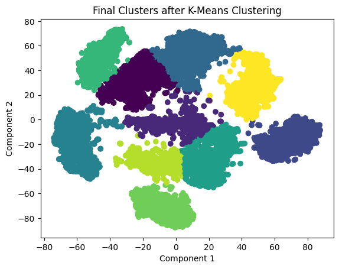
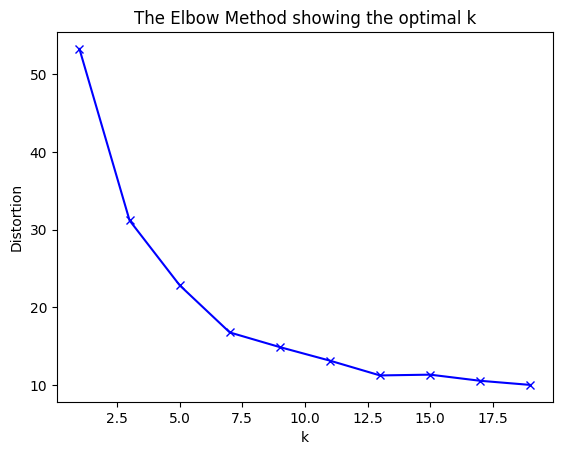

# MultiSpectral: Advanced K-Means Clustering with Cosine Similarity

[](https://opensource.org/licenses/MIT)

A Python implementation of a clustering algorithm using cosine similarity as the distance metric with K-means++ initialization. This project demonstrates how to find the optimal number of clusters in a dataset using the elbow method and visualize the clustering results.

## Features

- Custom implementation of K-means++ algorithm with cosine similarity metric
- Automatic determination of optimal cluster count using the elbow method
- Preprocessing capabilities including normalization and missing value imputation
- Dimensionality reduction options (PCA and t-SNE)
- Beautiful visualization of clustering results
- Robust handling of convergence and empty clusters

## Installation

Clone this repository:

```bash
git clone https://github.com/yourusername/cosine-similarity-clustering.git
cd cosine-similarity-clustering
```

Install the required dependencies:

```bash
pip install -r requirements.txt
```

## Usage

### Basic Example

```python
from clustering import CosineSimilarityClustering, load_data, preprocess_data

# Load and preprocess your data
data = load_data('data/your_data.txt')
processed_data = preprocess_data(data)

# Create clustering model
model = CosineSimilarityClustering(n_runs=10)

# Fit the model with 3 clusters
model.fit(processed_data, num_clusters=3)

# Get cluster assignments
labels = model.labels_

# Access cluster centers
centers = model.cluster_centers_
```

### Running the Complete Analysis

The repository includes a full analysis pipeline in the main script:

```bash
python clustering.py
```

This will:

1. Load and preprocess the dataset
2. Find the optimal number of clusters using the elbow method
3. Perform clustering with the optimal K value
4. Visualize the results
5. Save the cluster assignments to a file

## Methodology

The clustering algorithm works as follows:

1. **Initialization**: Centers are chosen using the K-means++ algorithm to ensure they are well-distributed
2. **Assignment**: Each data point is assigned to the nearest cluster based on cosine similarity
3. **Update**: Cluster centers are recalculated as the mean of all points in the cluster
4. **Iteration**: Steps 2-3 are repeated until convergence or maximum iterations
5. **Multiple Runs**: The entire process is repeated multiple times with different initializations to avoid local minima

## Results and Insights

### Cluster Visualization



The visualization above shows the final clusters after applying our cosine similarity-based K-means algorithm. The dataset has been projected onto a 2D space using PCA for visualization purposes. Key observations:

- The algorithm successfully identified distinct clusters with clear boundaries
- We can observe 10 well-separated clusters, each represented by a different color
- Some clusters show higher density than others, indicating potential substructures within the data
- The spatial distribution suggests meaningful patterns in the original high-dimensional feature space

### Optimal K Selection



The elbow curve above shows the relationship between the number of clusters (K) and the distortion (Sum of Squared Errors). Key insights:

- The distortion decreases as K increases, which is expected behavior
- A significant "elbow" point can be observed around K=10, suggesting this is where additional clusters start providing diminishing returns
- After K=12.5, the curve flattens considerably, indicating that additional clusters don't significantly reduce distortion
- For this dataset, values between K=10 and K=12 provide a good balance between model complexity and explanatory power

## Business Applications & Impact

This clustering methodology provides significant value in various business contexts:

### Customer Segmentation

By applying this algorithm to customer purchase history and behavior data, businesses can identify natural segments with similar preferences. These insights enable:

- Personalized marketing campaigns targeting specific customer groups
- Product recommendations tailored to segment preferences
- Improved customer retention by addressing segment-specific needs

### Anomaly Detection

The cosine similarity metric excels at identifying outliers that don't fit established patterns:

- Fraud detection in financial transactions
- Quality control in manufacturing processes
- Network security monitoring for unusual patterns

### Content Organization

For companies dealing with large document repositories:

- Automatic classification of support tickets for efficient routing
- Content recommendation systems based on similarity measures
- Intelligent knowledge base organization

### Skills Demonstrated

This project showcases several high-value skills applicable in data science roles:

- Advanced algorithm implementation and optimization
- Feature engineering and dimensionality reduction techniques
- Hyperparameter tuning and model evaluation
- Data visualization and effective communication of complex insights
- Software engineering best practices (modular code, documentation)

## Public Dataset Examples

To demonstrate this clustering approach, you can use any of these publicly available datasets:

### 1. E-commerce Customer Behavior

The [Online Retail Dataset](https://archive.ics.uci.edu/dataset/352/online+retail) contains actual transactions from a UK online retailer, perfect for customer segmentation analysis.

```python
# Download link
dataset_url = "https://archive.ics.uci.edu/ml/machine-learning-databases/00352/Online%20Retail.xlsx"
```

### 2. Text Document Clustering

The [20 Newsgroups dataset](https://scikit-learn.org/stable/datasets/real_world.html#newsgroups-dataset) provides ~18,000 newsgroup posts on 20 topics, ideal for testing document clustering.

```python
from sklearn.datasets import fetch_20newsgroups
newsgroups = fetch_20newsgroups(subset='all')
```

### 3. Image Feature Clustering

The [Fashion MNIST](https://github.com/zalandoresearch/fashion-mnist) dataset contains 70,000 fashion product images that can be used for feature-based clustering.

```python
from tensorflow.keras.datasets import fashion_mnist
(x_train, y_train), (x_test, y_test) = fashion_mnist.load_data()
```

## Contributing

Contributions are welcome! Please feel free to submit a Pull Request.

## License

This project is licensed under the MIT License - see the [LICENSE](LICENSE) file for details.

## Acknowledgments

- Implementation inspired by scikit-learn's KMeans algorithm
- Visualization techniques based on seaborn and matplotlib best practices
