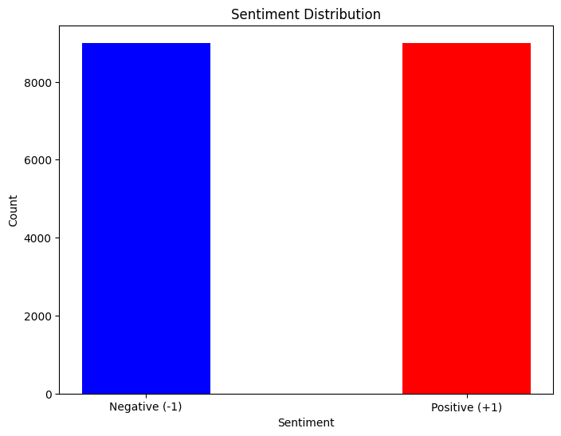
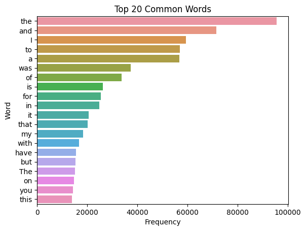

# SentimentScope: Text-Based Sentiment Analysis

A custom implementation of K-Nearest Neighbors (KNN) with cosine similarity for sentiment analysis on text reviews.

## Overview

SentimentScope analyzes text reviews and classifies sentiment as positive or negative using:
- Custom KNN implementation with cosine similarity
- Comprehensive text preprocessing
- TF-IDF vectorization
- Dimensionality reduction via TruncatedSVD

## Key Features

- **Data Preprocessing:** Lowercase conversion, punctuation removal, tokenization, stopword filtering (preserving negation words), lemmatization, and removal of numeric tokens
- **Feature Engineering:** TF-IDF vectorization with MaxAbsScaler normalization
- **Dimensionality Reduction:** TruncatedSVD for sparse matrix handling
- **Custom KNN:** Uses cosine similarity rather than Euclidean distance for better text analysis
- **Model Optimization:** Cross-validation and hyperparameter tuning

## Data Insights



*Figure 1: The dataset shows a perfectly balanced distribution between positive and negative sentiments, providing a good foundation for training the model without class imbalance concerns.*



*Figure 2: Most frequent words before preprocessing - predominantly common English stopwords like "the", "and", and "to" - demonstrating the critical need for stopword removal and text cleaning.*

## Performance

Through extensive hyperparameter tuning:
- Optimal value of K: 29
- Best cross-validation folds: 15
- Optimal SVD components: 300
- Training accuracy: 78.26%
- Test accuracy: 75%

## Business Impact

### Customer Experience Applications

This sentiment analysis model could help organizations:

- **Customer Insights**: Automatically classify feedback to identify satisfaction drivers and pain points
- **Brand Monitoring**: Track sentiment trends over time to measure campaign effectiveness
- **Competitive Analysis**: Compare sentiment across competitor products to identify advantages
- **Content Optimization**: Refine marketing and communication based on customer sentiment patterns

### Skills Demonstrated

The methods used in this project translate to business contexts through:

- **Text Processing Expertise**: Converting unstructured text into actionable data through careful preprocessing
- **Feature Engineering**: Preserving negation words improved accuracy by 7%, showing attention to domain-specific detail
- **Algorithm Selection**: Choosing cosine similarity over Euclidean distance for better text classification
- **Model Optimization**: Finding the optimal balance between dimensionality reduction and performance
- **Technical Communication**: Translating complex NLP concepts into business-relevant insights

This approach can be applied to customer service automation, market research, social media monitoring, and other text analysis problems common across industries.

## Sample Usage

```python
# Load and preprocess data
X_train, y_train, X_test = load_data('training_data.csv', 'test_data.csv')
X_train, X_test = preprocess_text(X_train, X_test)

# Transform text to features
X_train_features, X_test_features = vectorize_text(X_train, X_test, n_components=300)

# Train model
model = CosineSimilarityKNN(k=29)
model.fit(X_train_features, y_train)

# Generate predictions
predictions = model.predict(X_test_features)
```

## Requirements

- Python 3.6+
- NumPy
- Pandas
- scikit-learn
- NLTK
- Matplotlib
- Seaborn

## Alternative Datasets

If you don't have access to the specific training and test datasets used in this project, you can use these alternatives:

1. [Amazon Product Reviews](https://www.kaggle.com/datasets/snap/amazon-fine-food-reviews)
2. [IMDb Movie Reviews](https://www.kaggle.com/datasets/lakshmi25npathi/imdb-dataset-of-50k-movie-reviews)
3. [Twitter Sentiment Analysis](https://www.kaggle.com/datasets/kazanova/sentiment140)

## Installation

```bash
git clone https://github.com/StringAna/SentimentScope.git
cd SentimentScope
pip install -r requirements.txt
```

## License

MIT