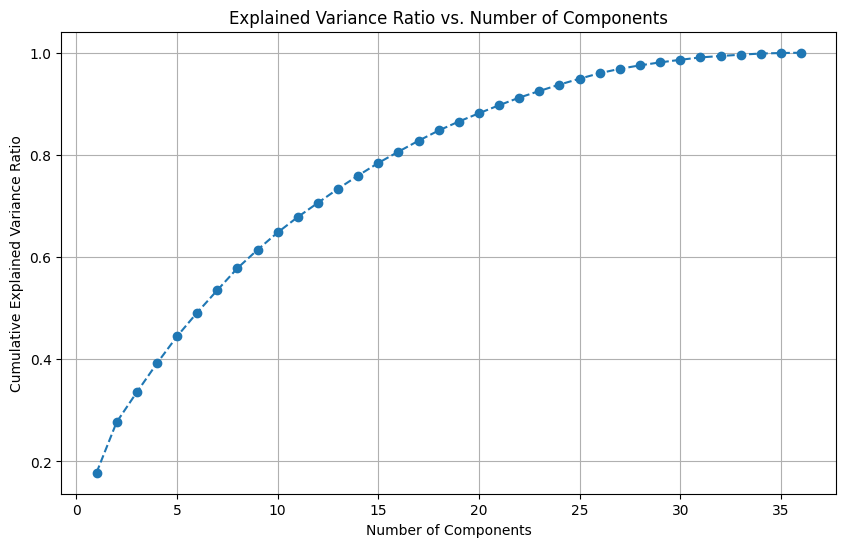

# Student Performance Predictor

A machine learning project that predicts student performance categories using a custom K-Nearest Neighbors algorithm implementation.

## Overview

This project demonstrates:
- Custom KNN algorithm implementation from scratch
- Dimensionality reduction through PCA
- Cross-validation for model evaluation
- Hyperparameter optimization

## Key Features

- **Custom KNN Implementation**: Built from scratch for educational purposes
- **Data Preprocessing**: Feature scaling and dimensionality reduction
- **Cross-Validation**: Custom k-fold implementation to validate model performance

## Data Analysis & Results

The model achieves 71.43% accuracy with:
- K = 23 neighbors
- 15-fold cross-validation
- 33 principal components (95% variance retention)

### Visualizations


*Figure 1: Class distribution showing performance categories*


*Figure 2: Correlation heatmap visualizing relationships between features*



*Figure 3: PCA explained variance analysis showing optimal component selection*

## Implementation Insights

- **Feature Scaling**: StandardScaler outperformed MinMaxScaler for distance calculations
- **Dimensionality Reduction**: PCA with 33 components preserved 95% of data variance
- **Feature Selection**: Tested manual selection by removing non-contributing features

## Business Impact

### Educational Management Applications

This predictive model could help educational institutions:

- **Early Intervention**: Identify at-risk students before academic performance declines
- **Resource Allocation**: Optimize tutoring and support resources based on predicted needs
- **Program Effectiveness**: Evaluate educational interventions by tracking prediction changes
- **Personalized Learning**: Tailor educational approaches to different performance groups

### Skills Demonstrated

The methods used in this project translate to business contexts through:

- **Data-Driven Decision Making**: Systematic approach to testing hypotheses with measurable results
- **Feature Engineering**: Identifying which factors truly influence outcomes
- **Algorithm Optimization**: Finding the right balance between model complexity and performance
- **Technical Communication**: Translating complex technical findings into actionable insights

This approach can be applied to customer segmentation, churn prediction, recommendation systems, and other classification problems common in business environments.

## Getting Started

### Prerequisites
- Python 3.7+
- Dependencies: pandas, numpy, matplotlib, seaborn, scikit-learn

### Installation
```bash
git clone https://github.com/yourusername/student-performance-predictor.git
cd student-performance-predictor
pip install -r requirements.txt
```

### Usage
```bash
python student_performance_predictor.py
```