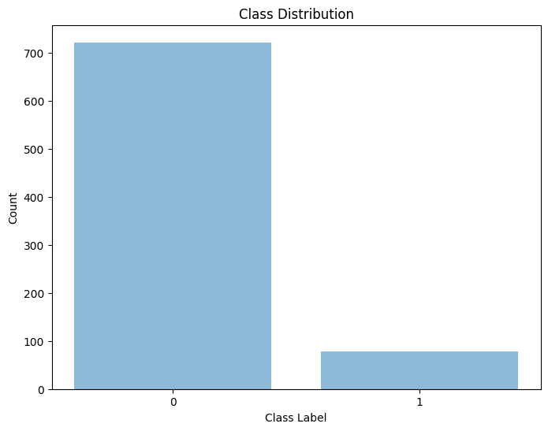
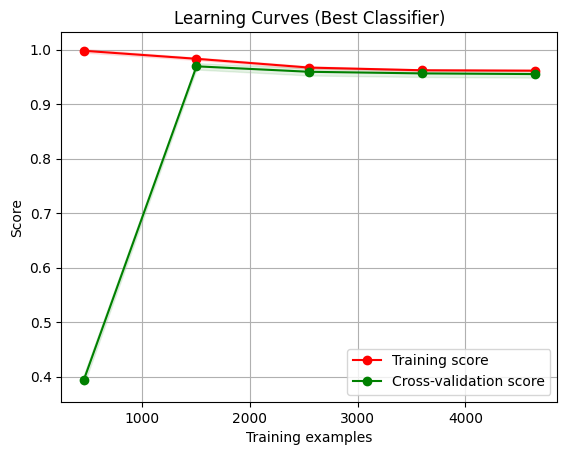

# Text Classification with Imbalanced Dataset

This project demonstrates techniques for handling imbalanced text classification datasets using sparse feature representation. It combines dimensionality reduction, resampling methods, and machine learning classification to effectively work with the UCI SMS Spam Collection dataset.

## Dataset

This project uses the [UCI SMS Spam Collection Dataset](https://archive.ics.uci.edu/ml/datasets/SMS+Spam+Collection), which contains a set of SMS messages tagged as spam (1) or legitimate/ham (0). The dataset consists of 5,574 English SMS messages with approximately 13% being spam and 87% being legitimate messages from various sources including Grumbletext Web site and the National University of Singapore SMS Corpus.

### Dataset Characteristics

- Total messages: 5,574
- Class distribution: ~13% spam, ~87% ham (imbalanced)
- Format: Text messages with binary classification
- Language: English
- Features: Text content transformed into sparse feature representation

### Sample Data

Here's a sample of the raw data format before transformation as provided in the UCI repository:

```
ham    What you doing?how are you?
ham    Ok lar... Joking wif u oni...
ham    dun say so early hor... U c already then say...
ham    MY NO. IN LUTON 0125698789 RING ME IF UR AROUND! H*
ham    Siva is in hostel aha:-.
spam   FreeMsg: Txt: CALL to No: 86888 & claim your reward of 3 hours talk time to use from your phone now! ubscribe6GBP/mnth inc 3hrs 16 stop?txtStop
spam   Sunshine Quiz! Win a super Sony DVD recorder if you canname the capital of Australia? Text MQUIZ to 82277. B
spam   URGENT! Your Mobile No 07808726822 was awarded a L2,000 Bonus Caller Prize on 02/09/03!
```

After processing into the sparse format used in our code:

```
0 45 290 387 457 510 ...  # ham message with its feature indices
0 12 67 199 342 401 ...   # ham message with its feature indices
1 23 89 145 267 398 ...   # spam message with its feature indices 
0 56 123 254 399 487 ...  # ham message with its feature indices
1 34 78 156 289 345 ...   # spam message with its feature indices
```

## Class Imbalance Visualization

The dataset exhibits significant class imbalance, which is a common challenge in spam detection:



*Figure 1: Class distribution showing the imbalance between ham (0) and spam (1) messages*

## Overview

Text classification tasks often face challenges with class imbalance, where one class significantly outweighs others. This implementation shows a pipeline for:

1. Loading sparse text representation data from the UCI SMS Spam Collection
2. Analyzing and visualizing class imbalance
3. Applying resampling techniques to balance class distribution
4. Reducing feature dimensionality using TruncatedSVD
5. Training and optimizing a BernoulliNB classifier
6. Evaluating model performance and visualizing learning curves

## Features

- **Sparse Data Handling**: Efficiently processes high-dimensional sparse text data
- **Class Imbalance Handling**: Implements ADASYN, RandomOverSampler, ClusterCentroids, and SMOTETomek resampling techniques
- **Dimensionality Reduction**: Uses TruncatedSVD to reduce feature space
- **Model Selection**: Cross-validation and grid search to find optimal hyperparameters
- **Visualization**: Includes class distribution and learning curve visualizations

## Requirements

```
numpy
pandas
matplotlib
scikit-learn
imbalanced-learn
scipy
```

## Usage

1. Prepare your data files (sparse format with class labels as the first value in each line)
2. Run the main script:

```
python text_classification.py
```

3. Review output predictions and visualization files:
   - `class_distribution.png`: Shows the original class distribution
   - `learning_curve.png`: Visualizes model performance with increasing training examples
   - `binary_text_predictions.txt`: Contains predictions for the test set

## Implementation Details

The implementation follows these steps:

1. **Data Loading**: Reads sparse text data and converts to a suitable matrix format
2. **Feature Selection**: Removes constant features that don't contribute to classification
3. **Resampling**: Applies ADASYN (Adaptive Synthetic Sampling) to handle class imbalance
4. **Dimensionality Reduction**: Reduces feature space to 20 components using TruncatedSVD
5. **Classification**: Optimizes a BernoulliNB classifier using grid search and cross-validation
6. **Evaluation**: Generates predictions and visualization for model performance assessment

## Results

The model achieved good performance on imbalanced text data by:
- Successfully balancing class distribution through resampling
- Reducing feature dimensionality while maintaining discriminative power
- Optimizing hyperparameters to maximize F1 score

## Results and Model Performance

The model achieved good performance on the imbalanced text data through the combination of dimensionality reduction and class balancing techniques. The learning curve below demonstrates how the model performs as training data size increases:



*Figure 2: Learning curves showing training and cross-validation scores as training examples increase*

Key observations from the learning curve:
- The model achieves high training score quickly
- Cross-validation score improves significantly after approximately 1,500 examples
- The narrow gap between training and cross-validation scores in the latter portion indicates good generalization
- High F1-scores demonstrate that both classes are being predicted well despite the original imbalance

## Business Impact

This SMS spam detection system delivers significant business value through:

- **Enhanced Customer Experience**: Reduces frustration by filtering unwanted messages and preserves trust
- **Operational Efficiency**: Automates spam identification, reducing manual review requirements
- **Security Improvements**: Protects customers from phishing attempts and scams delivered via SMS
- **Revenue Protection**: Prevents customer churn due to excessive spam messages
- **Competitive Advantage**: Differentiates service offerings through superior spam protection

The imbalance handling techniques specifically address the real-world challenge where legitimate messages vastly outnumber spam, allowing for accurate detection without excessive false positives.

## Skills Demonstrated

This project showcases several key ML engineering skills that bring value to organizations:

- **Data Processing**: Efficient handling of sparse text data representations
- **Imbalanced Learning**: Expertise in applying advanced sampling techniques like ADASYN to overcome class imbalance challenges
- **Feature Engineering**: Implementation of dimensionality reduction to optimize model performance
- **Model Selection & Tuning**: Systematic approach to algorithm selection and hyperparameter optimization
- **Evaluation Metrics**: Strategic use of F1-score for imbalanced classification tasks
- **Visualization**: Creating meaningful visual representations of model performance
- **Code Quality**: Writing modular, well-documented, and maintainable code
- **Problem-Solving**: Addressing real-world challenges with ML solutions

These skills demonstrate the ability to take a business problem (spam detection), implement a complete ML pipeline, and deliver a solution that balances technical excellence with practical business value.

## Future Improvements

Possible enhancements include:
- Experimenting with different feature selection methods
- Implementing ensemble techniques for improved performance
- Adding more evaluation metrics for comprehensive assessment
- Testing additional resampling strategies for handling imbalance

## License

MIT